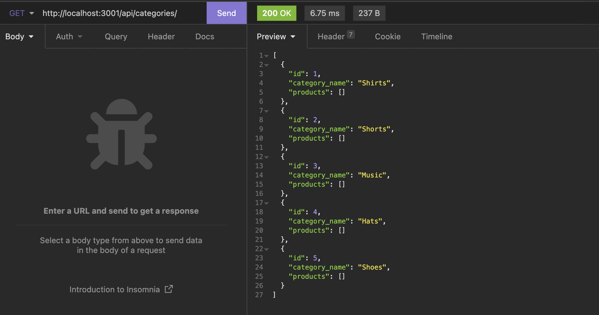
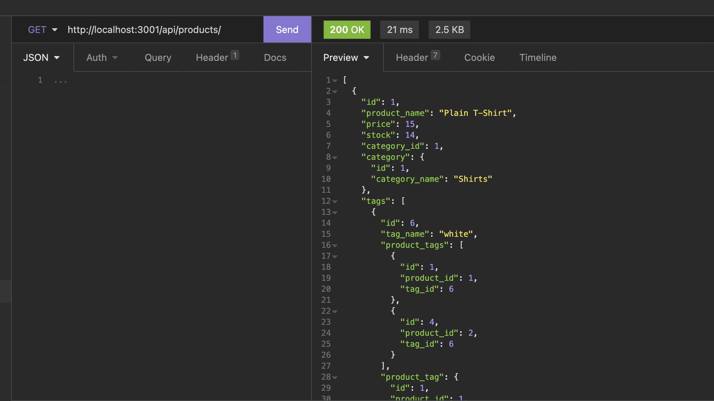

# Object Relational Mapping (ORM): E-commerce Back End

## Purpose
To create the backend e-commerce site that allow the user to edit the company inventory such as adding, deleting, or editing categoires, products, or tags in the database.

## Built With:
- Node.js
- Express.js
- MySQL
- dotenv
- Sequelize

## Github Link
https://github.com/p-her/ORM-ecommerce-backend

## Video Link

https://drive.google.com/file/d/1WmwzL3PGj9G6DPncuV7MeT36E_dYlGq9/view

